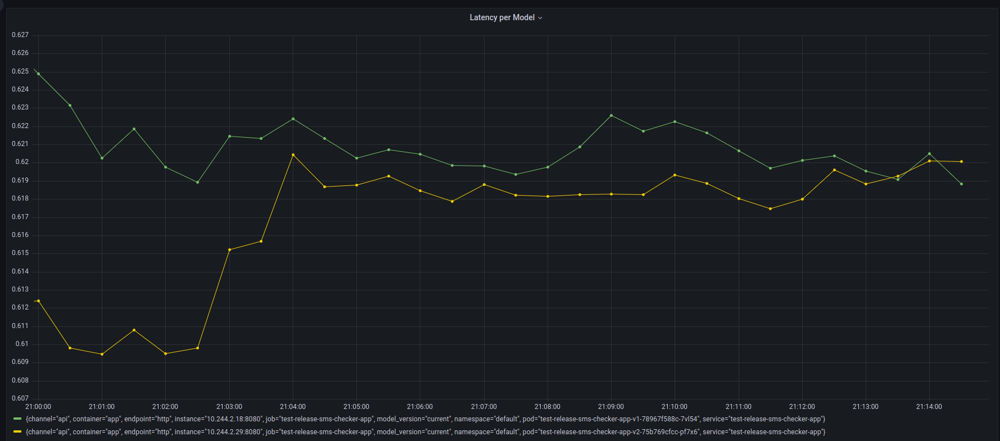

# Continuous Experimentation

We introduced a new Canary version (v2), where 90% of the traffic is going to the stable version (v1), and 10% to the Canary version.

---

## Hypothesis

The experiment evaluates the following hypothesis:
  
Deploying the new model version in v2 reduces the p95 message classification latency by at least **10%** compared to v1.

---

## Experiment Setup
We ran the two versions separately and traffic was generated by sending requests every 0.2 seconds. We ran both versions for 15 minutes and compared the latencies using the Grafana dashboard.

---

## Results
The following Grafana visualization shows the p95 classification latency over time for both versions:

The canary version (v2, yellow line) has a slightly lower latency than the stable version (v1, green line) for most of the experiment duration.  
However, the difference is marginal and remains below the 10% reduction.

---

## Conclusion
The Canary version is an improvement of the application, with regards to the latency. However, the difference is not significant, which means the hypothesis of a 10% decrease in latency is rejected.